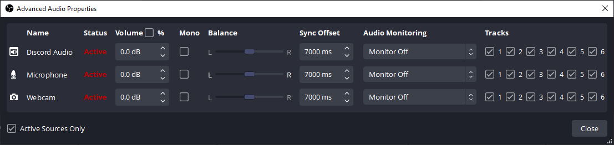
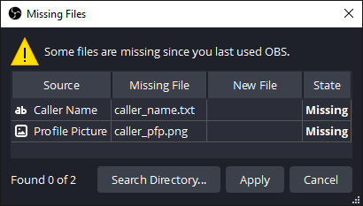

The project allows you to create a call-in livestream using Discord and OBS. The stream is audio-only.

Features include:
- Segregation of callers
- Ability for moderators to talk to callers in private and verify them
- A broadcast delay and dump button to cut off any obscenities or accidents
- Automatically display the caller's name and profile picture the moment they join the call. These are not updated if the caller changes them mid-call for safety.

# Table of Contents <!-- omit in toc -->
- [Requirements](#requirements)
- [Installation](#installation)
- [Discord](#discord)
  - [Server Structure](#server-structure)
  - [Overview](#overview)
  - [Roles and Permissions](#roles-and-permissions)
    - [Role: @everyone](#role-everyone)
    - [Role: Caller X](#role-caller-x)
    - [Role: Verified](#role-verified)
    - [Role: Moderator](#role-moderator)
    - [Role: Bot](#role-bot)
  - [Process](#process)
    - [Starting the Stream](#starting-the-stream)
    - [Queuing](#queuing)
    - [During the call](#during-the-call)
    - [After the call](#after-the-call)
    - [Ending the steam](#ending-the-steam)
  - [Bot](#bot)
    - [Adding bot](#adding-bot)
- [OBS](#obs)
  - [Installation](#installation-1)
  - [Set up](#set-up)
  - [Scenes](#scenes)
  - [Script](#script)
  - [Hotkeys](#hotkeys)
  - [Audio](#audio)
  - [Troubleshooting](#troubleshooting)

# Requirements
- Discord
- OBS
- Virtual audio cables (or similar)

# Installation
- Install Python 3 (any version should work, but this was developed on python 3.10.6)
- Open the terminal and run
```bash
git clone https://github.com/DenM-dev/Call-in_Livestream_System.git
cd Call-in_Livestream_System
pip install -r requirements.txt
```

Open `discord_config.py` and edit the values as needed.

For `DISCORD_TOKEN`, make sure to follow the instructions in the [Bot section](#bot).


# Discord
## Server Structure

```
Admin
* moderator-only
* bot-logs
* live-call

Queue 1
* text1
* voice1

Queue 2
* text2
* voice2

[Queue 3 onwards...]
```

- Every channel should be private. This isolates callers from each other.
- Every channel should be accessible to "Moderator" and "Bot" roles.
- Set each `Queue X` category to be accessible to the "Caller X" role. This should make `textX` and `voiceX` open to just one caller.

## Overview

- Create a new discord account and disable the ability to receive friend requests and DMs. This account would be for voice calls only. Any moderators should also do the same for their own sake, as their names are visible to all callers.
    - If you'd like to manage multiple accounts at the same time, you can use [Sandboxie](https://sandboxie-plus.com/) and [Discord Portable](https://portapps.io/app/discord-portable/)
- Keep only the bare minimum permissions for callers. Callers will not be able to share their screens, post image, links, etc. The only possible attack they can do is by changing their profile picture or changing their display name. The moderators will see these, but the viewers will be safe.
- You can set the server to have different verification levels. At the lowest levels, the person only needs email verification. At the highest level, they need phone verification. Not foolproof, but it helps.

## Roles and Permissions
### Role: @everyone
Disable ALL permissions for `@everyone` except the following:

- View Channels
- Send Messages
- Read Message History
- Connect
- Speak
- Video
- Use Voice Activity
- Change Nickname (optional)

### Role: Caller X
Create new roles titled "Caller 1", "Caller 2", and so on. No need to change any permissions.

### Role: Verified
Create a "Verified" role for verified callers. They will also be given a checkmark (✅) to make them easier to identify.

### Role: Moderator
Create a "Moderator" role for Moderators.

Make sure to enable the following:
- Allow anyone to @mention this role
- Display role member separately from online members
- Use Application Commands

### Role: Bot
Create a "Bot" role that will be given to bots.

Make sure to enable the following:
- Display role member separately from online members

And set these permissions:
- Manage Roles
- Manage Server
- Create Invite
- Manage Nicknames
- Kick Members
- Ban Members
- Read Messages/View Channels
- Send Messages
- Manage Messages
- Read Message History
- Mute Members
- Deafen Members
- Move Members


## Process
### Starting the Stream

- Run the bot using:
```bash
python discord_bot.py
```
- Go to Settings > Notifications, then scroll down to Sounds and make sure the following are disabled:
  - Deafen
  - Undeafen
  - Mute
  - Unmute
  - Voice Disconnected
  - User Join
  - User Leave
  - User Moved
  - (You can disable other sounds if you like)

- Right click a name in the user list > Apps > Create Invite
- Share the invite with people so they can join the queue. You do not need to set a time limit or use limit since the invite will be cleared at the end of the stream by using the "Clear All" or "Remove Unqueued" commands

### Queuing

- When a person joins the server, a bot automatically assigns them a role with their queue number (ie. it will assign them "Caller X"). This role unlocks a voice channel and a text channel that only they can see.
- **Text channel:** The bot will post an introduction to the caller. If the captcha is enabled, they will be presented with one.  the rules of discourse and instructions to help with their connection, etc. The user can use this channel to ask for help and for moderators to converse with the user. When the caller leaves, this channel is wiped clean for the next user.
- **Voice channel:** The user can go here, make sure their microphone is working, etc. They MUST be in the voice room before you can pull them into #live-call
- Moderators can screen the callers in the text and voice channels and give them the verified role once they're done. To verify a user, you must:
  - Right click the user > App > Verify User

### During the call

- When you are ready to speak to the caller, move them from their `#voice` channel to `#live-call`. This is where you will actually speak to the person.
- This room is NOT visible to anyone except the person you move into this room. Again, this protects privacy
- You can have the caller muted by default if you like, then you unmute them. Your choice.

### After the call

- Once you are done the call, kick the person from the server. The bot will free up their position in the queue and allow new callers to take their position.

### Ending the steam

- When you are done the session, you should `Right click the bot > Apps > ` and  do one of the following:
  - **Remove Unqueued**: 
  - **Clear All**: 

## Bot

The Discord bot does the following:
- assign roles automatically when a person joins
- frees up roles/the queue when a user leaves the server
- sends DMs to users when the queue is full and once the server is cleared
- saves the callers display name and profile picture to allow OBS integration

User Functions:

To use these, `right click a user > Apps > then select the command`

- **Clear All**: Kick ALL users, revoke all server invites, and purge all channels. This should be used once you've finished with the last caller. Can only be used on the bot to prevent accidental use.
- **Create Invite**: Create server invite that is valid for the duration of the call
- **List Users**: List all users in the server. Verified users are shown in the order they were verified.
- **Remove Unqueued**: Kick users who are unqueued, and revoke all server invites. This prevents new participants from joining the queue. Can only be used on the bot to prevent accidental use.
- **Verify User**: Assign the Verified role to the user and modify the nickname accordingly.

Channel Functions:
To use these, `right click a message in a channel > Apps > then select the command`. Only valid in `#textX` channels.
- **Purge Channel**: Delete all messages in the channel

### Adding bot
- https://discord.com/developers
- Create a new app
- In the Bot tab, and make sure you've enabled "Server Members Intent" and "Message Content Intent"
- In the Bot tab, press "Reset Token" and copy the new value it generates. This will be your `DISCORD_TOKEN`
- In OAuth2 > URL Generator, enable the "bot" scope and generate the url. Make sure the permissions are the same as [here](#role-bot).
- Copy the url and paste it into your browser. This allows you to invite the bot to your server

# OBS

## Installation
- [Waveform plugin](https://obsproject.com/forum/resources/waveform.1423)

## Set up
1. Open `obs/discord_callin_scenes.json` using a text editor, search for "Call-in_Livestream_System" and set the paths appropriately.

2. Once that's done, import the scenes into OBS by going to `Scene Collection > Import` then locate `obs/discord_callin_scenes.json`.

## Scenes
| Scene        | Description                                                   |
| ------------ | ------------------------------------------------------------- |
| Final        | The scene that you will always be on. Never change from this. |
| ----         | Separator                                                     |
| Delayed-Main | Contains a delayed version of "Live-Main"                     |
| Live-Main    | Contains "Live-CallGroup > Live-Call" and "Live-Solo"         |
| Live-Solo    | The screen when you are not in a call                         |
| Live-Call    | The screen for calls                                          |

For more info, see [`obs/OBS_scenes.md`](obs/OBS_scenes.md)


## Script
- Go to `Tools > Scripts > Python Settings` and set the directory to your python install path. If you did this correctly, you will see "Loaded Python Version: X.XX"

- Go to `Tools > Scripts > "+" > Locate "obs_dump_button.py"`

Set the settings as follows:
| Setting                      | Description                                                                                                                                    | Value                  |
| ---------------------------- | ---------------------------------------------------------------------------------------------------------------------------------------------- | ---------------------- |
| Delay Time                   | How long to display the cover when the dump button is pressed                                                                                  | 7.0                    |
| Cover                        | The element to display when the dump button is pressed                                                                                         | CoverGroup             |
| Audio Source 1               | Your microphone                                                                                                                                | Microphone             |
| Audio Source 2               | Caller audio                                                                                                                                   | Discord Audio          |
| Caller Profile Picture       | Caller's Profile Picture (automatically taken by the discord bot)                                                                              | path/to/caller_pfp.png |
| Delay before Call Transition | How long to wait before displaying the call scene. The caller's name takes about 1-2 seconds to update, so this removes that awkward period    | 1.5                    |
| Call Scene Group             | The group in "Live-Main" that contains a reference to the "LiveCall" scene. This is displayed when the caller's profile picture is downloaded. | Live - Call Group      |

When you're done, press "⟳" to reload the script

## Hotkeys
Go to `File > Settings > Hotkeys` and set the following:

- **Htk Dump Button**: When you press this button, the screen will be covered and audio muted instantly and will remain covered as long as you hold the button. The screen will be shown `Delay Time` seconds after you release this key.
- `Live-Main > Show 'Live-CallGroup'`: Button to manually show the call scene
- `Live-Main > Hide 'Live-CallGroup'`: Button to manually hide the call scene. If it's the same as `Show 'Live-CallGroup'` then the button will act as a toggle.

## Audio

- Set the output of discord to a virtual audio cable. The caller's voice is now on this cable
- In OBS, set the virtual audio cable as an input called "Discord Audio"
- In the Audio Mixer, go to `Advanced Audio Properties (gears)` then set the `Sync Offset` for all your audio sources to the same value as `Delay Time * 1000` (default: 7000 ms)




## Troubleshooting
If you see this image when you open OBS, just press "Cancel". These files will automatically be created and deleted when a person is added and removed from the call.

